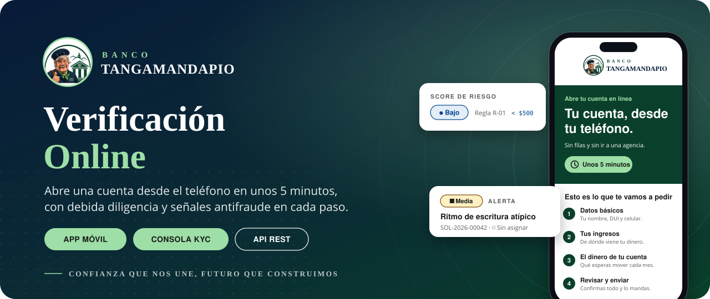
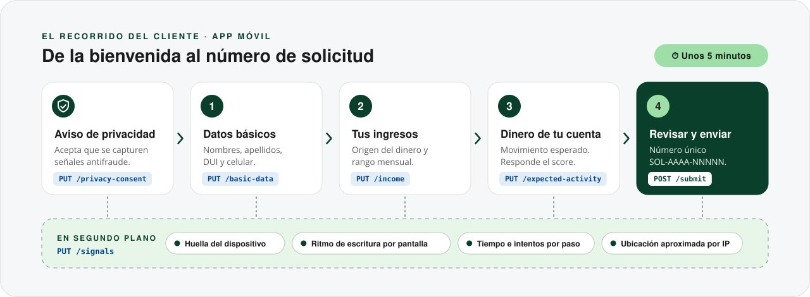
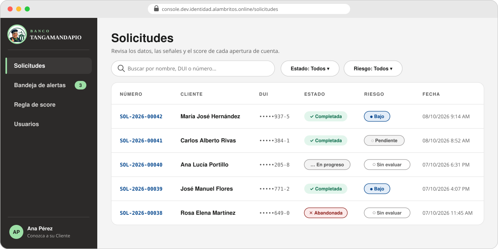
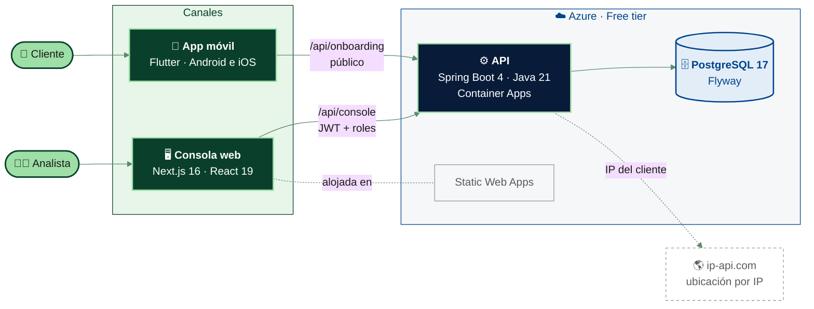
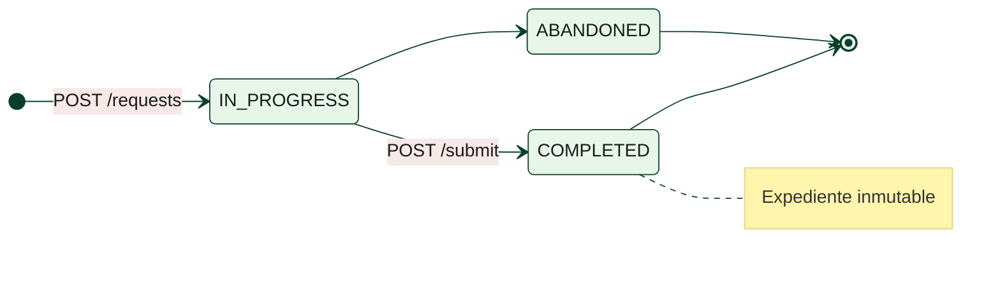
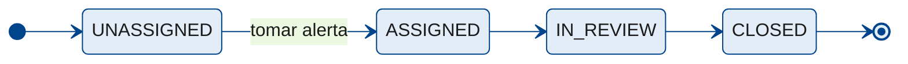
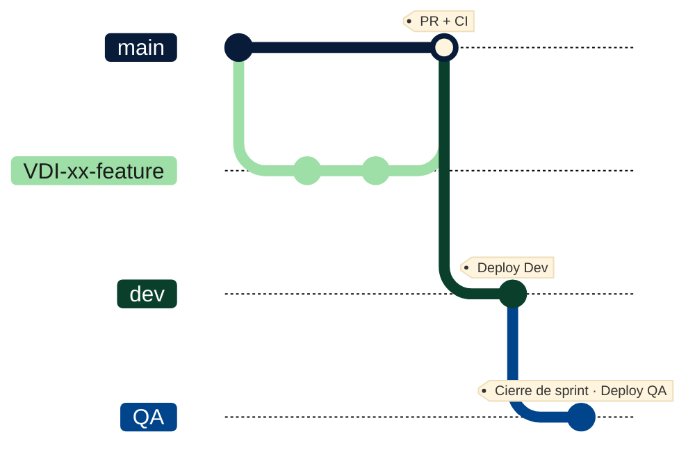

<div align="center">



<br>

[](https://github.com/dream-parking/verificacion-online/actions/workflows/ci.yml)
[](https://sonarcloud.io/summary/new_code?id=dream-parking_verificacion-online)
[](https://sonarcloud.io/summary/new_code?id=dream-parking_verificacion-online)


**[Consola Dev](https://console.dev.identidad.alambritos.online)** ·
**[API Dev](https://api.dev.identidad.alambritos.online/swagger-ui.html)** ·
**[Guía de integración](docs/integracion-api.md)** ·
**[CI/CD](docs/cicd.md)** ·
**[Definition of Done](docs/definition-of-done.md)**

</div>

<br>

## ✦ ¿Qué es Verificación Online?

**Banco Tangamandapio** quiere que cualquier persona en El Salvador abra su cuenta **desde el teléfono, sin filas y sin ir a una agencia**. Verificación Online es la plataforma que lo hace posible sin bajar la guardia: mientras el cliente llena su solicitud, el banco aplica **debida diligencia (Conozca a su Cliente)**, calcula un **score de riesgo** y reúne **señales antifraude** para que los analistas decidan con información.

<table>
<tr>
<td width="33%" valign="top">

### 📱 Para el cliente
Una app en **4 pasos y unos 5 minutos**: datos básicos, ingresos, el dinero que moverá la cuenta y un resumen para confirmar. Errores claros y en español.

</td>
<td width="33%" valign="top">

### 🛡️ Para el banco
Cada solicitud llega con su **score**, su **huella de dispositivo**, el **ritmo de escritura** y la **ubicación aproximada**. Al enviarse, el expediente queda **inmutable**.

</td>
<td width="33%" valign="top">

### 🧑‍💼 Para los analistas
Una **consola web** con roles para revisar solicitudes, tomar **alertas** de fraude, consultar la **regla de score** y administrar usuarios.

</td>
</tr>
</table>

<br>

## 🧭 El recorrido del cliente



> [!NOTE]
> **Primero el consentimiento.** Ninguna señal se captura antes de que la persona acepte el aviso de privacidad; el servidor guarda la versión del aviso que aceptó y desde qué IP.

| | Regla | Qué significa |
|:-:|---|---|
| 🎯 | **Score R-01** | Si el monto mensual esperado no supera **USD 500**, el riesgo es **bajo**; si lo supera, queda **pendiente de evaluación**. Umbral provisional, pendiente de confirmar con Conozca a su Cliente. |
| 🔒 | **Expediente inmutable** | Al salir de `IN_PROGRESS`, la base de datos rechaza editar o borrar las declaraciones. |
| 🧾 | **Número único** | El servidor asigna `SOL-AAAA-NNNNN` al enviar; reenviar responde `409` y nunca duplica. |
| 📍 | **Ubicación por IP** | La app no envía coordenadas: el servidor resuelve la ubicación aproximada a partir de la IP. |

<br>

## 🖥️ La consola de Conozca a su Cliente



<table>
<tr>
<td width="25%" valign="top" align="center">

**📋 Solicitudes**<br>
<sub>Búsqueda por nombre, DUI o número; detalle con ingresos, movimiento esperado, score, señales y línea de tiempo.</sub>

</td>
<td width="25%" valign="top" align="center">

**🚨 Bandeja de alertas**<br>
<sub>Filtros por estado, responsable, cuenta y fechas. Fraude y Administración pueden <i>tomar</i> una alerta.</sub>

</td>
<td width="25%" valign="top" align="center">

**⚖️ Regla de score**<br>
<sub>La regla vigente, su umbral, su versión y su estado (provisional, confirmada…).</sub>

</td>
<td width="25%" valign="top" align="center">

**👥 Usuarios**<br>
<sub>Altas, roles, bajas y contraseñas iniciales. Solo para administradores.</sub>

</td>
</tr>
</table>

<details>
<summary><b>Roles y catálogo de alertas</b></summary>
<br>

| Rol | Nombre en la consola | Puede |
|---|---|---|
| `KYC_LEAD` | Conozca a su Cliente | Ver solicitudes, alertas y la regla de score |
| `FRAUD_ANALYST` | Fraude y cumplimiento | Todo lo anterior y **tomar alertas** |
| `ADMIN` | Administración | Todo lo anterior y **gestionar usuarios** |

| Criticidad | Alerta |
|:-:|---|
|  | Movimientos por encima del perfil declarado · Ingresos de origen distinto al declarado |
|  | Actividad en horario nocturno · Dispositivo nuevo con ubicación distinta · Varias solicitudes desde el mismo dispositivo |
|  | Ritmo de escritura atípico · Monto declarado cercano al umbral |
|  | Cambio de teléfono durante la solicitud · Acceso fuera del horario habitual |

La sesión dura 8 horas; tras 5 intentos fallidos el correo se bloquea 15 minutos. El rol se lee en cada petición, así que un cambio o una baja aplica de inmediato.

</details>

<br>

## 🏛️ Arquitectura



<details>
<summary><b>Ciclo de vida de una solicitud y de una alerta</b></summary>
<br>





</details>

<br>

## 🌎 Ambientes

| | 🧪 Dev | ✅ QA | 🏦 Prod |
|---|---|---|---|
| **Rama** | `dev` | `QA` | — |
| **Consola** | [console.dev.identidad…](https://console.dev.identidad.alambritos.online) | [console.qa.identidad…](https://console.qa.identidad.alambritos.online) | reservado |
| **API** | [api.dev.identidad…](https://api.dev.identidad.alambritos.online/swagger-ui.html) | [api.qa.identidad…](https://api.qa.identidad.alambritos.online/swagger-ui.html) | reservado |
| **App** | *Tangamandapio Dev* · Firebase | *Tangamandapio QA* · Firebase | — |

> [!TIP]
> La API escala a cero para no gastar: la primera petición tras un rato inactiva puede tardar **30 a 60 segundos**.

### 🌿 Flujo de ramas



Cada historia entra por **PR a `main`** (que integra y no despliega). Lo estable se promueve a **`dev`** para que QA lo pruebe, y al cerrar el sprint pasa a **`QA`**. Nadie hace push directo a esas tres ramas: los checks `test`, `lint-build` y `analyze-test` son obligatorios.

<br>

## 🚀 Empezar

```bash
git clone https://github.com/dream-parking/verificacion-online.git
```

<details>
<summary><b>⚙️ Backend</b> · Spring Boot + PostgreSQL</summary>
<br>

Requiere **Java 21** y **Docker**. Desde `backend/`:

```bash
docker compose up -d
```
```bash
./mvnw spring-boot:run -Dspring-boot.run.profiles=dev
```

O, sin levantar Postgres a mano (usa uno desechable):

```bash
./mvnw spring-boot:test-run -Dspring-boot.run.profiles=dev
```

Swagger queda en `http://localhost:8080/swagger-ui.html`. Variables de la consola (primer administrador, clave JWT, CORS) en [`backend/.env.example`](backend/.env.example).

</details>

<details>
<summary><b>🖥️ Consola web</b> · Next.js</summary>
<br>

Requiere **Node 22**. Desde `webconsole/`:

```bash
npm install
```
```bash
npm run dev
```

Abre `http://localhost:3000`. Por defecto habla con `http://localhost:8080`; para usar otro API define `NEXT_PUBLIC_API_URL` o `NEXT_PUBLIC_APP_ENV=dev|qa`.

</details>

<details>
<summary><b>📱 App móvil</b> · Flutter</summary>
<br>

Desde `onboarding/`:

```bash
flutter pub get
```
```bash
flutter run
```

Usa la API de Dev por defecto. La guía completa (emuladores, celular por cable, QA, Firebase) está en [`onboarding/README.md`](onboarding/README.md).

</details>

<br>

## ✅ Calidad

<table>
<tr>
<td align="center" width="25%">

### `≥ 70 %`
<sub>Cobertura de líneas del <b>backend</b><br>JaCoCo en <code>./mvnw verify</code></sub>

</td>
<td align="center" width="25%">

### `≥ 40 %`
<sub>Cobertura de la <b>app móvil</b><br>paso “Cobertura mínima” del CI</sub>

</td>
<td align="center" width="25%">

### `≥ 80 %`
<sub>Cobertura del <b>código nuevo</b><br>Quality Gate <i>Sonar way</i></sub>

</td>
<td align="center" width="25%">

### `A · A · A`
<sub>Reliability, maintainability<br>y security en Sonar</sub>

</td>
</tr>
</table>

El CI vive en un solo workflow que solo ejecuta los componentes que cambiaron. Detalle en la [Definition of Done](docs/definition-of-done.md).

<br>

## 📚 Documentación

| | Documento | Para qué |
|:-:|---|---|
| 🔌 | [Integración con la API](docs/integracion-api.md) | Flujo móvil, endpoints de la consola, reglas de negocio y autenticación |
| 📜 | [`openapi.json`](docs/openapi.json) | Contrato OpenAPI 3.1 para generar clientes |
| 🚢 | [CI/CD](docs/cicd.md) | Ramas, ambientes, DNS, despliegues y SonarQube Cloud |
| ✅ | [Definition of Done](docs/definition-of-done.md) | Criterios del equipo y cómo se hacen cumplir |
| 🎨 | [Guía de estilos](docs/styles.md) | Tokens de color, tipografía y componentes |
| 💸 | [Revisión de costos](docs/cost-review.md) · [recursos de Azure](docs/azure-resources.csv) | Todo en planes gratuitos |

<details>
<summary><b>📁 Estructura del repositorio</b></summary>
<br>

```text
verificacion-online/
├── backend/        ⚙️  API Spring Boot: onboarding, riesgo, alertas, consola, seguridad
├── webconsole/     🖥️  Consola web Next.js para Conozca a su Cliente y Fraude
├── onboarding/     📱  App Flutter de apertura de cuenta y captura de señales
├── docs/           📚  Integración, CI/CD, DoD, estilos, costos e imágenes del README
└── .github/        🔁  Un CI por cambios + deploys a Azure y Firebase
```

</details>

<br>

<div align="center">


<sub>Hecho por <b>Los Alan-bres Ágiles</b> · ESEN</sub>

</div>
